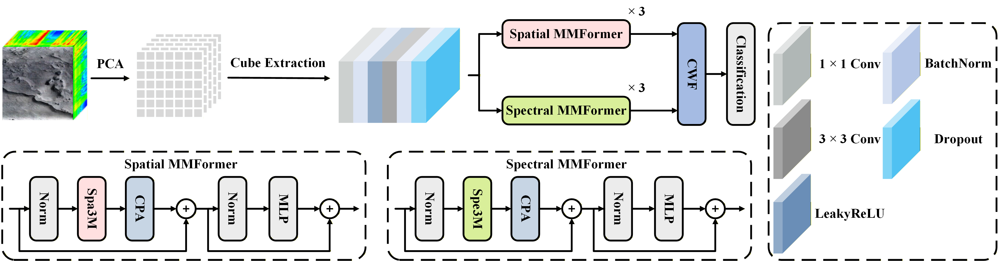

MMFormer: Macro-Micro Transformer for Small-Sample Classification of Mars Hyperspectral Image, TGRS, 2026.
==
Tingrui Feng, Yali Wang, Chuan Fu, Bo Du, and Fulin Luo.
***

Code for the paper: **MMFormer: Macro-Micro Transformer for Small-Sample Classification of Mars Hyperspectral Image**.

This paper has been accepted for publication in *IEEE Transactions on Geoscience and Remote Sensing (TGRS)*.

<div align=center></div>
Fig. 1: The overall architecture of the proposed MMFormer for Mars hyperspectral image classification. MMFormer contains spatial and spectral Macro-Micro Transformer branches, Center Prompt Attention (CPA), and Cross Weighted Fusion (CWF).

## Abstract
Mars hyperspectral image classification (Mars HSIC) provides invaluable information for accurate mineral identification and Martian geology studies. However, this task remains challenging owing to scarce labeled samples, high spectral similarity, and environmental noise. Capturing both local details and global contexts is crucial for this task, yet convolutional neural networks struggle with global dependencies, while Transformers tend to neglect fine local details and bring unnecessary computational burden. To address this issue, we propose MMFormer, a Macro-Micro Transformer tailored for Mars HSIC. With a dual-branch architecture, our method adopts the macro-kernel perception and micro-kernel modulation strategy to synergize global contexts with local details in both spatial and spectral domains. To mitigate severe background interference, we introduce a Center Prompt Attention (CPA) module that injects a center-focused prompt to adaptively reweight attention toward the central pixel. To integrate distinct feature representations, a Cross Weighted Fusion (CWF) module is constructed to dynamically fuse complementary spatial and spectral information.

## Training and Test Process
1. Prepare the Mars hyperspectral data files as described in the dataset section.
2. Install the dependencies:

```bash
pip install -r requirements.txt
```

3. Run MMFormer on the target dataset:

```bash
python train.py --dataset HC --data_dir ./data --device cuda:0
python train.py --dataset NF --data_dir ./data --device cuda:0
python train.py --dataset UP --data_dir ./data --device cuda:0
```

The default settings follow the paper protocol: PCA to 30 components, patch size 13, 10 labeled samples per class, 10 repeated runs, Adam optimizer with learning rate 1e-4, batch size 128, and 100 epochs.

To save prediction maps for the best run:

```bash
python train.py --dataset HC --data_dir ./data --device cuda:0 --save_maps
```

Results are saved to:

```text
results/<dataset>/MMFormer/
```

## DataSet Download
--
The experiments use the public HyMars benchmark:

[HyMars: Mars Hyperspectral Image Classification Benchmark Datasets](https://www.scidb.cn/en/detail?dataSetId=4ff0774d45464f239a73f37796f7a786)

For details about the dataset, please refer to:

[1] Bobo Xi, Yun Zhang, Jiaojiao Li, et al. HyMars: Mars Hyperspectral Image Classification Benchmark Datasets[DS/OL]. V2. Science Data Bank, 2025[2025-01-20]. https://doi.org/10.57760/sciencedb.19732. DOI:10.57760/sciencedb.19732.

## DataSet Preparation
--
The data files are not included in this repository. After downloading the dataset, please place the MATLAB files under `data/` with the following names and keys:

| Dataset | Data file | Data key | Label file | Label key | Classes |
| --- | --- | --- | --- | --- | --- |
| HC | `holden.mat` | `holden` | `holden_gt.mat` | `holden_gt` | 6 |
| NF | `NiliFossae.mat` | `NiliFossae` | `NiliFossae_gt.mat` | `NiliFossae_gt` | 9 |
| UP | `Utopia.mat` | `Utopia` | `Utopia_gt.mat` | `Utopia_gt` | 9 |

Large `.mat`, `.npy`, and `.npz` files are excluded by `.gitignore`.

## Main Arguments
--
| Argument | Default | Description |
| --- | --- | --- |
| `--dataset` | `HC` | Dataset name: `HC`, `NF`, or `UP` |
| `--pca_components` | `30` | Number of PCA components |
| `--patch_size` | `13` | Spatial patch size |
| `--train_samples_per_class` | `10` | Number of training samples per class |
| `--runs` | `10` | Number of repeated runs |
| `--epochs` | `100` | Training epochs per run |
| `--batch_size` | `128` | Batch size |
| `--lr` | `1e-4` | Learning rate |
| `--embedding_dim` | `128` | Feature embedding dimension |
| `--device` | `auto` | Device name, such as `cuda:0` or `cpu` |

## References
--
If you find this code helpful, please kindly cite:

[1] T. Feng, Y. Wang, C. Fu, B. Du, and F. Luo, "MMFormer: Macro-Micro Transformer for Small-Sample Classification of Mars Hyperspectral Image," in IEEE Transactions on Geoscience and Remote Sensing, 2026.

Citation Details
--
BibTeX entry:

```bibtex
@ARTICLE{TGRS_2026_MMFormer,
  author={Feng, Tingrui and Wang, Yali and Fu, Chuan and Du, Bo and Luo, Fulin},
  journal={IEEE Transactions on Geoscience and Remote Sensing},
  title={MMFormer: Macro-Micro Transformer for Small-Sample Classification of Mars Hyperspectral Image},
  year={2026},
  volume={},
  number={},
  pages={1-1},
  keywords={Mars;Hyperspectral image classification;Transformer;Small-sample learning;Macro-micro attention},
  doi={to be updated}
}
```

## Licensing
--
Copyright (C) 2026 Tingrui Feng, Yali Wang, Chuan Fu, Bo Du, and Fulin Luo.

This project is released for academic research use. Please contact the authors if you have questions about reuse or redistribution.
